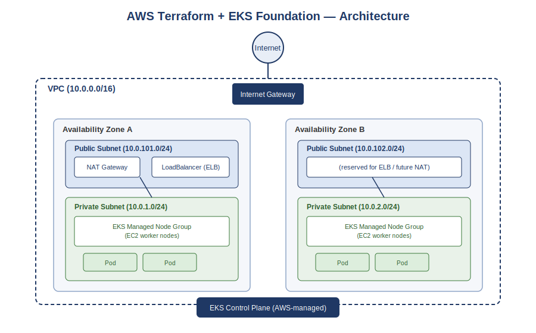

# AWS Terraform + EKS Foundation

Infrastructure-as-Code project that provisions a production-style AWS
networking layer and a working Amazon EKS (Kubernetes) cluster from scratch
using Terraform — then deploys a sample application onto it with Helm.


## Architecture



- A VPC spanning **2 Availability Zones** for high availability
- **Public subnets** hold the NAT Gateway and any Load Balancers
- **Private subnets** hold the EKS worker nodes — nodes are never directly
  exposed to the internet
- The **EKS control plane** is fully managed by AWS
- Traffic flow: Internet → Internet Gateway → Load Balancer (public subnet)
  → Pods running on worker nodes (private subnet)

## Tech stack

| Layer | Tool |
|---|---|
| Infrastructure as Code | Terraform (`terraform-aws-modules/vpc`, `terraform-aws-modules/eks`) |
| Cloud provider | AWS |
| Container orchestration | Kubernetes (Amazon EKS) |
| Application packaging | Helm |
| Local tooling | VS Code, AWS CLI, kubectl, Helm CLI |

## Prerequisites

Install these locally before starting:

- [AWS CLI v2](https://docs.aws.amazon.com/cli/latest/userguide/getting-started-install.html) — configured with an IAM user (`aws configure`)
- [Terraform](https://developer.hashicorp.com/terraform/install) `>= 1.6.0`
- [kubectl](https://kubernetes.io/docs/tasks/tools/#kubectl)
- [Helm](https://helm.sh/docs/intro/install/) `>= 3.0`
- An AWS account with permissions to create VPCs, EKS clusters, and IAM roles

> **Cost warning:** EKS charges ~$0.10/hour for the control plane, plus EC2
> costs for worker nodes and a NAT Gateway. Running this for a few hours to
> take screenshots costs a small amount — **always run `terraform destroy`
> when you're done** (see Cleanup below).

## Repo structure

```
aws-terraform-eks-foundation/
├── README.md
├── .gitignore
├── diagrams/
│   └── architecture.svg
├── terraform/
│   ├── main.tf                    # provider + backend config
│   ├── variables.tf               # input variables
│   ├── vpc.tf                     # VPC, subnets, NAT gateway
│   ├── eks.tf                     # EKS cluster + managed node group
│   ├── outputs.tf                 # useful output values
│   └── terraform.tfvars.example   # copy to terraform.tfvars and edit
├── helm/
│   └── hello-world/               # sample chart to smoke-test the cluster
└── screenshots/                   # screenshots referenced below
```

## Step-by-step

### 1. Clone and configure

```bash
git clone https://github.com/<your-username>/aws-terraform-eks-foundation.git
cd aws-terraform-eks-foundation/terraform
cp terraform.tfvars.example terraform.tfvars
# edit terraform.tfvars if you want a different region/project name
```

### 2. Initialize Terraform

```bash
terraform init
```

### 3. Review the plan

```bash
terraform plan
```

### 4. Apply

```bash
terraform apply
```

Type `yes` when prompted. This takes **10–20 minutes** — EKS control planes
are slow to provision, that's normal.


### 5. Connect kubectl to the new cluster

```bash
aws eks update-kubeconfig --region eu-central-1 --name eks-foundation
kubectl get nodes
```


### 6. Deploy the sample app with Helm

```bash
cd ../helm
helm install demo hello-world/
kubectl get pods
kubectl get svc demo-hello-world
```

Wait for the `EXTERNAL-IP` on the LoadBalancer service, then open it in a
browser.


### 7. Cleanup — always do this

```bash
helm uninstall demo
cd ../terraform
terraform destroy
```

Type `yes` when prompted. Confirm in the AWS Console that the cluster, NAT
Gateway, and VPC are gone.


## What this project demonstrates

- Writing modular, reusable Terraform rather than clicking through the AWS
  Console
- Understanding AWS networking fundamentals (public vs. private subnets,
  NAT gateways, route tables, Availability Zones)
- Standing up and connecting to a managed Kubernetes cluster (EKS)
- Packaging and deploying an application with Helm
- Cost-conscious infrastructure management (single NAT gateway, proper
  teardown)


---

**Author:** Oluwasola Ogundana — [GitHub](https://github.com/Oluwasola1) · [LinkedIn](#)
